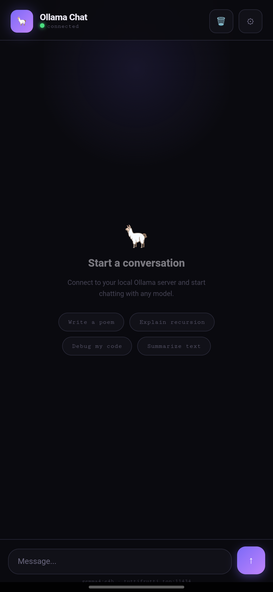
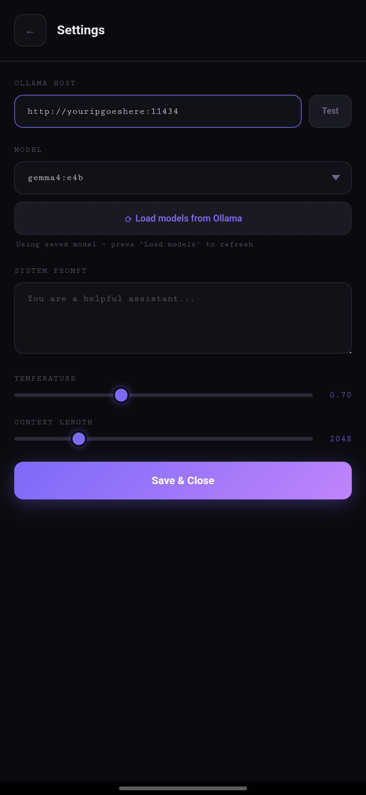
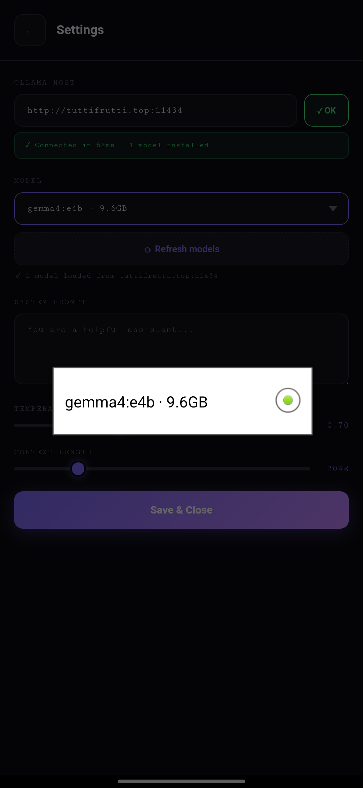
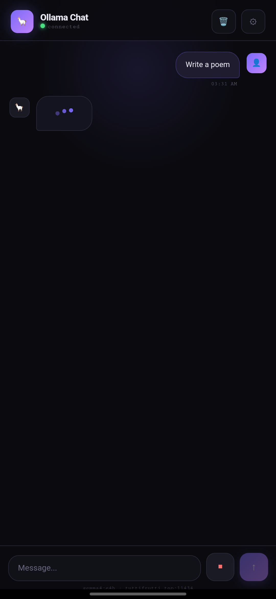

<div align="center">


# Ollama Chat

**A native Android chat app for your self-hosted Ollama server.**  
Beautiful dark UI · Streaming responses · Zero cloud dependency


</div>

---

## Screenshots

<div align="center">
<table>
  <tr>
    <td align="center"><br/><sub>Home</sub></td>
    <td align="center"><br/><sub>Settings</sub></td>
    <td align="center"><br/><sub>Model picker</sub></td>
    <td align="center"><br/><sub>Chat</sub></td>
  </tr>
</table>
</div>

---

## What is this?

Ollama Chat is a mobile-first Android app that lets you chat with any AI model running on your own [Ollama](https://ollama.com) server — from anywhere in the world, over the internet.

No OpenAI. No API keys. No subscriptions. Your hardware, your models, your data.

---

## Features

- 🦙 **Connects to any Ollama server** — local or remote, by IP or domain
- ⚡ **Live streaming responses** — tokens appear in real time as the model generates
- 🔍 **Auto-fetches installed models** — no manual typing, pulls the list straight from Ollama
- ✅ **Connection tester** — shows latency and model count before you save
- 🎛️ **Configurable** — system prompt, temperature, context length
- 💾 **Persistent settings** — remembers your host, model and preferences
- 🧠 **Full conversation history** — multi-turn context sent with every message
- ⛔ **Stop generation** — cancel mid-stream at any time
- 🗑️ **Clear chat** — start fresh with one tap
- 🌑 **Dark UI** — easy on the eyes, built for OLED screens

---

## Requirements

| What | Details |
|------|---------|
| Android | API 24+ (Android 7.0 or higher) |
| Ollama server | Any machine running `ollama serve` |
| Network | Phone must be able to reach the Ollama host (same WiFi, VPN, or public IP) |

---

## Setup

### 1. Set up your Ollama server

On the machine running Ollama, make sure it listens on all interfaces and allows cross-origin requests:

```bash
sudo systemctl edit ollama
```

Add these lines:

```ini
[Service]
Environment="OLLAMA_HOST=0.0.0.0"
Environment="OLLAMA_ORIGINS=*"
```

Then restart:

```bash
sudo systemctl daemon-reload
sudo systemctl restart ollama
```

Verify it's listening:

```bash
sudo ss -tlnp | grep 11434
# Should show 0.0.0.0:11434
```

### 2. Install the APK

Download the latest APK from [Releases](../../releases) and install it on your Android device.  
You may need to enable **"Install from unknown sources"** in your Android settings.

### 3. Configure the app

1. Open the app and tap the **⚙ Settings** icon
2. Enter your Ollama host URL, e.g. `http://yourserver.com:11434`
3. Tap **Test** — you should see `✓ Connected` with latency and model count
4. The model list auto-populates — select your model
5. Optionally set a system prompt, temperature, and context length
6. Tap **Save & Close**

You're ready to chat.

---

## Building from source

### Prerequisites

- Android Studio or the Android SDK command line tools
- JDK 17
- Git

### Steps

```bash
git clone https://github.com/tuttizpro218/OllamaPhoneChat.git
cd OllamaPhoneChat
./gradlew assembleDebug
```

The APK will be at `app/build/outputs/apk/debug/app-debug.apk`.

### GitHub Actions

This repo includes a CI workflow that automatically builds a debug APK on every push. Download it from the **Actions** tab → latest run → **Artifacts**.

---

## Project structure

```
OllamaPhoneChat/
├── app/
│   └── src/main/
│       ├── assets/
│       │   └── index.html          # The entire chat UI (HTML/CSS/JS)
│       ├── java/com/example/ollama/
│       │   └── MainActivity.kt     # WebView wrapper
│       ├── res/
│       │   └── mipmap-*/           # App icons
│       └── AndroidManifest.xml
├── .github/workflows/
│   └── build.yml                   # CI build action
└── app/build.gradle
```

The app is a thin Kotlin WebView wrapper around a single self-contained `index.html` file. All the chat logic — streaming, settings, markdown rendering, connection testing — lives in that HTML file with vanilla JS. No frameworks, no bundler.

---

## How it works

```
Phone  ──── HTTP fetch ────▶  Ollama server (:11434)
              (streaming)           │
              ◀── NDJSON tokens ────┘
                    │
              WebView JS
              parses & renders
              tokens in real time
```

The app calls Ollama's `/api/chat` endpoint with `stream: true`. The response is a stream of newline-delimited JSON objects, each containing a token. The JS reads these chunks and appends them to the chat bubble in real time, yielding to the UI thread every 100ms to keep the app responsive.

---

## Troubleshooting

**App crashes on launch**  
Make sure `compileSdk` and `targetSdk` in `build.gradle` match your Android version. Android 16 requires SDK 36.

**"Cannot reach host" error**  
- Check that `OLLAMA_HOST=0.0.0.0` is set and Ollama is restarted
- Check your firewall allows port 11434 (`sudo ufw allow 11434`)
- Make sure you're using `http://` not `https://` unless you have a reverse proxy with SSL

**"App isn't responding" dialog while generating**  
Tap **Wait** — this is Android detecting the streaming loop. It will complete. The throttled rendering (100ms updates) minimises this but long responses on slow models can still trigger it.

**No models in dropdown**  
Tap **Test** first to verify the connection, then tap **Load models from Ollama**. Make sure you have at least one model installed: `ollama pull llama3.2`

---

## License

MIT — do whatever you want with it.

---

<div align="center">
  Made with frustration and eventually triumph 🦙
</div>
